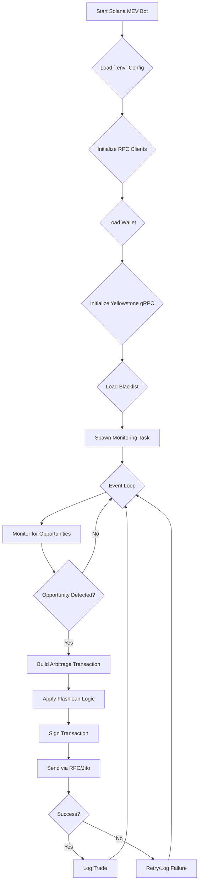
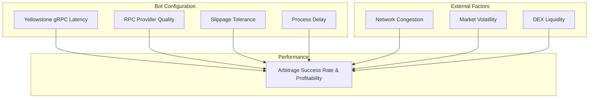
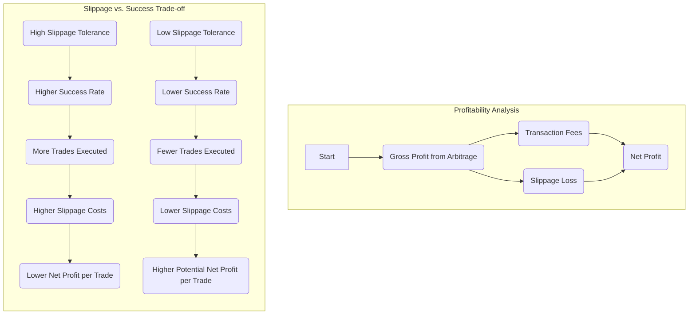
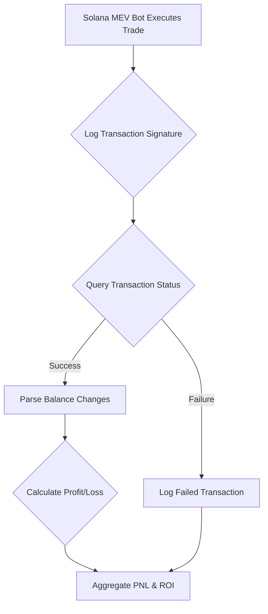

# Solana MEV Bot - Advanced Flashloan & Arbitrage Trading Bot

A high-performance, flash-loan-integrated MEV (Maximal Extractable Value) arbitrage bot for the Solana blockchain. This professional-grade **Solana trading bot** is engineered to identify and execute profitable arbitrage opportunities across a wide range of decentralized exchanges (DEXs). Our **Solana flashloan bot** leverages Kamino Finance flash loans to maximize capital efficiency, making it one of the most advanced **Solana arbitrage bots** available. This Rust-based **MEV bot** solution is designed for serious traders seeking automated profit generation through cross-DEX arbitrage on the Solana network.

## Contact Information

- **Discord**: [@solanmevbot]
- **Telegram**: [solanmevbot](https://t.me/solanmevbot)
- **Email**: [for38864@gmail.com](mailto:for38864@gmail.com)

## Overview

The **Solana Arbitrage Bot** is a sophisticated **MEV trading bot** framework designed for executing complex arbitrage strategies on the Solana network. This advanced **Solana trading bot** operates by continuously monitoring price discrepancies of token pairs across various decentralized exchanges (DEXs) and executing atomic, multi-leg trades to capitalize on these differences. As a powerful **Solana flashloan bot**, the integration of flash loans from Kamino Finance allows the bot to leverage significant capital without requiring large upfront investments, maximizing profitability and ROI potential.

This professional **Solana arbitrage bot** is engineered for automated trading, utilizing sophisticated algorithms to identify profitable opportunities across multiple liquidity pools. The bot supports cross-DEX arbitrage, enabling traders to profit from price differences between Raydium, Orca, Meteora, Pump AMM, and other major Solana DEXs. Whether you're looking for a **Solana MEV bot**, **Solana flashloan bot**, **Solana trading bot**, or **Solana arbitrage bot**, this comprehensive solution provides all the features needed for successful automated trading on the Solana blockchain.

Key features of this **Solana MEV bot** include:
- **Flashloan Integration**: Leverage Kamino Finance flash loans for capital-efficient arbitrage trading
- **Multi-DEX Support**: Monitor and trade across multiple Solana decentralized exchanges simultaneously
- **High-Speed Execution**: Optimized transaction building and submission for maximum success rates
- **Automated Trading**: Fully automated **Solana trading bot** that requires minimal manual intervention
- **Advanced MEV Strategies**: Sophisticated arbitrage detection and execution algorithms
- **Yellowstone gRPC Integration**: Low-latency event streaming for real-time opportunity detection
- **Jito Block Engine Ready**: Support for bundle submission and priority fee optimization

This tool is intended for experienced developers and quantitative traders with a strong understanding of blockchain technology, DeFi protocols, MEV strategies, and Solana network mechanics.

## Why Choose This Solana MEV Bot?

When searching for the best **Solana arbitrage bot**, **Solana flashloan bot**, or **Solana trading bot**, this solution stands out with its comprehensive feature set:

- **Advanced MEV Bot Architecture**: Built specifically for Solana blockchain, this **MEV bot** leverages cutting-edge technology to extract maximum value from on-chain opportunities
- **Flashloan Integration**: Unlike basic trading bots, this **Solana flashloan bot** integrates seamlessly with Kamino Finance, allowing you to trade with borrowed capital that's repaid within the same transaction
- **Multi-Strategy Support**: This **Solana arbitrage bot** supports various arbitrage strategies including cross-DEX arbitrage, triangular arbitrage, and flash loan arbitrage
- **Professional Trading Bot Features**: As a complete **Solana trading bot** solution, it includes transaction spam prevention, compute unit optimization, and multi-RPC support for maximum reliability
- **Automated Execution**: Set up once and let your **Solana MEV bot** run 24/7, automatically identifying and executing profitable trades without manual intervention
- **Rust Performance**: Built in Rust for maximum speed and efficiency, critical for **MEV bot** operations where milliseconds matter
- **Yellowstone gRPC Streaming**: Real-time mempool and account monitoring for instant opportunity detection
- **Jito Integration**: Ready for bundle submission and block-engine integration for maximum transaction success rates

Whether you're looking for a **Solana MEV bot**, **Solana flashloan bot**, **Solana trading bot**, or **Solana arbitrage bot**, this solution provides enterprise-grade functionality for serious traders and developers.

**Disclaimer:** This is an advanced trading tool that carries significant financial risk. The authors and contributors are not liable for any financial losses. Use this software at your own risk.

## Architecture Diagram

The following diagram illustrates the **Solana MEV bot's** operational flow:



## How It Works: The Solana MEV Bot Lifecycle

This **Solana arbitrage bot** operates through a structured, asynchronous lifecycle, designed for high performance and reliability. Understanding how this **Solana trading bot** works is essential for maximizing its potential as a profitable **MEV bot** solution. The **Solana flashloan bot's** workflow ensures optimal execution of arbitrage opportunities while minimizing risk and maximizing capital efficiency.

1. **Configuration Loading**: Upon launch, the **Solana MEV bot** reads the `.env` file to load its operational parameters, including the user's wallet, RPC endpoints, Yellowstone gRPC credentials, slippage settings, and trading parameters.

2. **Initialization**: The **Solana trading bot** establishes connections to the specified Solana RPC endpoints (both blocking and non-blocking clients). The main RPC is used for fetching on-chain data, while Yellowstone gRPC provides low-latency event streaming for real-time opportunity detection.

3. **Wallet and Token Account Setup**: The **Solana MEV bot** loads the user's keypair and checks wallet balance. For each configured token mint, it verifies the existence of Associated Token Accounts (ATAs) and can automatically create them if needed.

4. **Blacklist Loading**: The **Solana arbitrage bot** loads token blacklist from `blacklist.txt` if present, filtering out tokens that should not be traded.

5. **Yellowstone gRPC Connection**: The **Solana flashloan bot** establishes a connection to Yellowstone gRPC for real-time account and transaction monitoring. This enables the **Solana trading bot** to detect opportunities as they appear in the mempool or on-chain.

6. **Trading Loop**: The core component of the **Solana arbitrage bot** enters an infinite loop to continuously perform the following steps:
   - **Event Monitoring**: The **Solana MEV bot** monitors Yellowstone gRPC streams for relevant events (new token launches, liquidity additions, price discrepancies)
   - **Opportunity Detection**: When a profitable arbitrage opportunity is detected, the **Solana trading bot** evaluates the potential profit, checks against blacklist and risk parameters
   - **Build Transaction**: The **Solana flashloan bot** constructs an atomic transaction that executes the arbitrage strategy. This may include flash loan instructions (borrow, swap, repay) or direct multi-leg swaps across DEXs
   - **Transaction Signing**: The transaction is signed with the configured wallet
   - **Send Transaction**: The **Solana MEV bot** sends the transaction to the Solana network through the configured RPC endpoints. If Jito integration is enabled, the **Solana arbitrage bot** can submit bundles for improved inclusion probability
   - **Delay**: The loop waits for a configurable delay before starting the next iteration, allowing the **Solana trading bot** to balance between frequency of attempts and network resources

## Technical Deep Dive

This section provides an in-depth look at the technical architecture of the **Solana MEV bot**. Understanding these components is essential for optimizing the performance of your **Solana trading bot**, **Solana flashloan bot**, or **Solana arbitrage bot** setup.

### Event Monitoring (`src/engine/monitor.rs`)

The monitoring system is responsible for detecting trading opportunities for the **Solana MEV bot**.

- **Yellowstone gRPC Integration**: Subscribes to real-time account updates and transaction streams
- **Event Filtering**: Filters events based on configured criteria (token mints, program IDs, account changes)
- **Opportunity Detection**: Identifies arbitrage opportunities by comparing prices across multiple DEXs
- **Risk Assessment**: Evaluates opportunities against blacklist, dev buy limits, and other risk parameters

### Swap Execution (`src/engine/swap.rs`)

The swap execution system handles trade execution for the **Solana trading bot**.

- **Swap Direction**: Supports both buy and sell operations
- **Input Types**: Supports quantity-based or percentage-based trade sizing
- **Slippage Protection**: Configurable slippage tolerance to protect against unfavorable price movements
- **Jito Integration**: Optional bundle submission through Jito block engine for improved transaction success rates

### DEX Integration (`src/dex/`)

The DEX integration layer enables the **Solana arbitrage bot** to interact with multiple decentralized exchanges.

- **PumpFun Support**: Integration with PumpFun for new token launches
- **Multi-DEX Architecture**: Extensible architecture for adding support for Raydium, Orca, Meteora, and other DEXs
- **Pool Data Parsing**: Deserializes on-chain pool data for price calculations

### Transaction Building (`src/core/tx.rs`)

The transaction building system constructs atomic transactions for the **Solana MEV bot**.

- **Instruction Assembly**: Builds Solana instructions for swaps, flash loans, and other operations
- **Compute Budget**: Sets compute unit limits and priority fees for transaction optimization
- **Versioned Transactions**: Supports versioned transactions with Address Lookup Tables (ALTs) for efficient account packing
- **Atomic Execution**: Ensures all operations in a transaction succeed or fail together

## Supported DEXs - Multi-Exchange Arbitrage Support

This **Solana MEV bot** integrates with a comprehensive list of Solana's top decentralized exchanges, enabling sophisticated cross-DEX arbitrage strategies. The **Solana arbitrage bot** monitors price differences across all these platforms simultaneously, identifying profitable trading opportunities that a **Solana flashloan bot** can execute atomically. The **Solana trading bot's** multi-DEX support is essential for maximizing arbitrage opportunities:

- **PumpFun**: New token launches and early-stage trading
- **Raydium**: V4, Constant Product (CPMM), and Concentrated Liquidity (CLMM) pools
- **Meteora**: Dynamic Liquidity Market Maker (DLMM), Dynamic AMM, and DAMM V2
- **Orca**: Whirlpool (Concentrated Liquidity) pools
- **Additional DEXs**: Extensible architecture for adding more exchanges

*Note: Full multi-DEX routing and flashloan integration require implementation of the strategy modules. The framework provides the foundation for these features.*

## Performance, PNL, and ROI - Optimizing Your Solana MEV Bot

Understanding and optimizing your **Solana trading bot's** performance is critical for achieving profitability. Whether you're running a **Solana arbitrage bot**, **Solana flashloan bot**, or **Solana MEV bot**, this section provides a deeper look into the factors influencing performance and how to approach PNL and ROI analysis. Maximizing the efficiency of your automated trading strategy requires careful tuning of all performance parameters.

### Performance Tuning - Maximizing Your Solana Trading Bot Success Rate

The success of an arbitrage trade executed by your **Solana MEV bot** is a race against time. The **Solana arbitrage bot's** ability to quickly identify an opportunity, build a transaction, and have it included in a block before the opportunity disappears is paramount. For a **Solana flashloan bot**, speed is especially critical since flash loans must be repaid within the same transaction, leaving no margin for error or delay. Optimizing your **Solana trading bot's** performance involves balancing multiple factors to achieve maximum profitability.

The following diagram illustrates the key factors that influence the bot's performance:



- **RPC Provider**: The quality of your RPC provider is arguably the most critical factor for your **Solana MEV bot's** success. A low-latency, high-reliability RPC endpoint ensures that your **Solana trading bot** receives on-chain data quickly and can submit arbitrage transactions with minimal delay. For a **Solana flashloan bot**, RPC latency directly impacts profitability since flash loan arbitrage opportunities are extremely time-sensitive.

- **Yellowstone gRPC**: The **Solana MEV bot** leverages Yellowstone gRPC for real-time event streaming. A high-quality Yellowstone endpoint with low latency is essential for detecting opportunities before competitors. The **Solana arbitrage bot** relies on this stream to identify profitable trades as they appear.

- **Network Conditions**: High network congestion on Solana can lead to longer transaction confirmation times and increase the likelihood of your **Solana arbitrage bot's** transaction being dropped. The **Solana MEV bot** must adapt to network conditions to maintain optimal performance.

- **Market Volatility**: While volatility creates arbitrage opportunities for your **Solana trading bot**, it also means that those opportunities are fleeting. The **Solana arbitrage bot** must be able to act within milliseconds to capitalize on price discrepancies before they disappear. A well-tuned **Solana flashloan bot** can exploit these volatile conditions more effectively than traditional trading methods.

- **Slippage Tolerance**: The `SLIPPAGE` setting determines how much price movement your **Solana MEV bot** will tolerate. Higher slippage increases the chance of successful execution but reduces net profit per trade. Finding the optimal balance is key to maximizing your **Solana trading bot's** ROI.

- **Jito Integration**: When enabled, the **Solana MEV bot** can submit transactions through Jito bundles, improving inclusion probability. This is especially valuable for time-sensitive arbitrage opportunities where the **Solana flashloan bot** must execute quickly.

#### The Slippage vs. Success Rate Trade-off

Setting slippage tolerance is a delicate balancing act. The following diagram illustrates the trade-off between slippage tolerance and transaction success rate:



### PNL and ROI Analysis - Tracking Your Solana MEV Bot Performance

**This Solana MEV bot is a trade execution engine and does not have built-in PNL or ROI tracking.** To effectively measure your **Solana trading bot's** profitability, whether you're running a **Solana arbitrage bot** or **Solana flashloan bot**, you must implement a separate monitoring and analysis solution. Tracking performance metrics is essential for optimizing your automated trading strategy and ensuring long-term profitability.

The following diagram outlines a recommended workflow for tracking PNL:



A practical approach to implementing this workflow would be:

1. **Logging**: Modify the **Solana MEV bot** to log every transaction signature to a database or a file.
2. **Data Fetcher**: Create a separate script that periodically reads the transaction logs.
3. **On-Chain Verification**: For each signature, use the Solana RPC `getTransaction` method to fetch the transaction details.
4. **Balance Parsing**: Analyze the `preTokenBalances` and `postTokenBalances` fields in the transaction metadata to determine the exact change in your token balances.
5. **Profit Calculation**: Convert the token balance changes to a common currency (e.g., USDC) to calculate the net profit or loss for each trade.
6. **Aggregation**: Store the results in a database to track your overall PNL and ROI over time.

## Getting Started - Setting Up Your Solana MEV Bot

This guide will help you set up and configure your **Solana arbitrage bot**, **Solana flashloan bot**, or **Solana trading bot**. Whether you're new to MEV bots or an experienced trader, following these steps will get your automated trading system up and running on the Solana blockchain.

### Prerequisites

Before deploying your **Solana MEV bot**, ensure you have:
- [Rust and Cargo](https://www.rust-lang.org/tools/install) installed (required for compiling the **Solana trading bot**)
- A Solana wallet with sufficient SOL to cover transaction fees and potential flash loan costs
- Understanding of Solana network mechanics, DeFi protocols, and arbitrage trading strategies
- Access to a Solana RPC endpoint (paid RPC recommended for production)
- Yellowstone gRPC endpoint and token (optional but highly recommended for low-latency monitoring)

### Installation & Setup

1. **Clone the Repository:**
   Clone the **Solana MEV bot** repository to get started with your automated trading setup:
   ```bash
   git clone https://github.com/solanmevbot/solana-mev-bot.git
   cd solana-mev-bot
   ```

2. **Configure the Bot:**
   Configure your **Solana arbitrage bot** by creating a `.env` file with your credentials. This **Solana trading bot** requires proper configuration to execute profitable trades:
   ```bash
   touch .env
   ```
   
   Then, edit `.env` and add your configuration (see Configuration section below).

3. **Run the Bot:**
   Launch your **Solana MEV bot** to start automated arbitrage trading:
   ```bash
   cargo run
   ```

Once running, your **Solana arbitrage bot** will begin monitoring for profitable trading opportunities across multiple DEXs, executing trades automatically when arbitrage opportunities are detected.

## Configuration - Solana MEV Bot Settings

These settings control the core behavior of your **Solana trading bot**. Proper configuration is essential for optimal performance of your **Solana arbitrage bot** and **Solana flashloan bot** operations.

### Core Configuration (`.env` file)

The **Solana MEV bot** reads configuration from a `.env` file in the project root. All settings are loaded at startup.

#### `RPC_HTTP` - Primary RPC Endpoint

- **Description**: The primary Solana RPC HTTP URL for fetching on-chain data and submitting transactions
- **Type**: `string`
- **Example**: `https://api.mainnet-beta.solana.com`
- **Required**: Yes
- **Note**: Use a high-quality, low-latency RPC provider for optimal **Solana MEV bot** performance. Paid RPCs are recommended for production **Solana trading bot** deployments.

#### `PRIVATE_KEY` - Wallet Private Key

- **Description**: Your wallet's private key in base58-encoded format
- **Type**: `string`
- **Required**: Yes
- **Security Warning**: Never commit this to version control. Use a dedicated hot wallet with limited funds for your **Solana arbitrage bot**.

#### `YELLOWSTONE_GRPC_HTTP` - Yellowstone gRPC Endpoint

- **Description**: Yellowstone gRPC endpoint URL for real-time event streaming
- **Type**: `string`
- **Example**: `https://grpc.yellowstone.com`
- **Required**: Yes (for real-time monitoring)
- **Note**: Essential for low-latency opportunity detection in your **Solana flashloan bot**.

#### `YELLOWSTONE_GRPC_TOKEN` - Yellowstone Authentication Token

- **Description**: Authentication token for your Yellowstone gRPC provider
- **Type**: `string`
- **Required**: Yes (if using Yellowstone gRPC)
- **Note**: Obtain this from your Yellowstone provider to enable real-time monitoring for your **Solana MEV bot**.

#### `SLIPPAGE` - Slippage Tolerance

- **Description**: Maximum slippage tolerance as a percentage (0-100)
- **Type**: `integer`
- **Default**: `0`
- **Example**: `5` (for 5% slippage tolerance)
- **Note**: Higher slippage increases success rate but reduces net profit per trade. Balance carefully for your **Solana trading bot**.

#### `TOKEN_AMOUNT` - Trade Amount

- **Description**: Amount to trade per transaction (interpreted based on `SwapInType`)
- **Type**: `float`
- **Default**: `0.0000001`
- **Example**: `0.1` (for 0.1 SOL worth of tokens)
- **Note**: This is used by the **Solana arbitrage bot** to determine trade size.

#### `TIME_EXCEED` - Timeout Threshold

- **Description**: Maximum age in seconds for an opportunity before it's considered stale
- **Type**: `integer`
- **Required**: Yes
- **Example**: `30` (opportunities older than 30 seconds are ignored)
- **Note**: Helps the **Solana MEV bot** avoid executing on stale opportunities.

#### `COUNTER` - Counter Limit

- **Description**: Maximum number of trades or attempts per time period (strategy-dependent)
- **Type**: `integer`
- **Default**: `0` (unlimited)
- **Note**: Used for rate limiting in your **Solana trading bot**.

#### `MIN_DEV_BUY` - Minimum Dev Buy Threshold

- **Description**: Minimum developer buy amount heuristic (strategy-dependent)
- **Type**: `integer`
- **Default**: `0`
- **Note**: Used by the **Solana arbitrage bot** to filter opportunities based on developer activity.

#### `MAX_DEV_BUY` - Maximum Dev Buy Threshold

- **Description**: Maximum developer buy amount heuristic (strategy-dependent)
- **Type**: `integer`
- **Default**: `0`
- **Note**: Used by the **Solana MEV bot** to filter opportunities based on developer activity.

### Blacklist Configuration

The **Solana MEV bot** supports token blacklisting via a `blacklist.txt` file in the project root.

- **Format**: One token mint address per line
- **Location**: `blacklist.txt` in project root
- **Note**: If the file doesn't exist, the **Solana trading bot** will operate without blacklist filtering.

### Jito Integration

The **Solana flashloan bot** includes Jito client dependency for bundle submission.

- **Status**: Jito integration is available but requires implementation in your strategy modules
- **Benefits**: Improved transaction inclusion probability for time-sensitive arbitrage opportunities
- **Configuration**: Set `use_jito: true` in swap configuration (currently hardcoded in config)

## Operational Safety Tips for Your Solana MEV Bot

When running your **Solana MEV bot**, follow these safety guidelines:

- **Use a Fresh Hot Wallet**: Deploy your **Solana trading bot** with a dedicated hot wallet containing only the funds needed for trading. Never use your main wallet.
- **Start Small**: Begin with small trade amounts to test your **Solana arbitrage bot** configuration before scaling up.
- **Monitor Closely**: Watch your **Solana flashloan bot** closely during initial runs to ensure it's behaving as expected.
- **RPC Quality**: Use high-quality, paid RPC endpoints for production **Solana MEV bot** deployments. Free RPCs may have rate limits and higher latency.
- **Network Stability**: Run your **Solana trading bot** on a machine with stable internet connection and accurate system clock. Latency matters for MEV extraction.
- **Logging**: Enable comprehensive logging to track all trades and identify issues with your **Solana arbitrage bot**.
- **Flashloan Safety**: If implementing flashloan functionality, thoroughly test atomic repayment logic with small amounts first. Flash loans must be repaid in the same transaction.
- **Blacklist Management**: Regularly update your blacklist to avoid trading problematic tokens with your **Solana MEV bot**.

## Troubleshooting Your Solana MEV Bot

Common issues when running the **Solana MEV bot**:

- **Config Hangs at Startup**: Missing environment variables will cause the **Solana trading bot** to error and loop. Ensure `.env` is present and contains all required variables.
- **RPC Errors / Timeouts**: Use a paid RPC provider, verify `RPC_HTTP` is correct, and check rate limits. High-quality RPCs are essential for **Solana arbitrage bot** success.
- **Yellowstone Connection Issues**: Verify your `YELLOWSTONE_GRPC_HTTP` and `YELLOWSTONE_GRPC_TOKEN` are correct. Check your Yellowstone provider's status.
- **Build Issues**: Update your Rust toolchain with `rustup update` and rebuild the **Solana MEV bot**.
- **Transaction Failures**: Check slippage settings, ensure sufficient SOL balance, and verify RPC endpoint reliability for your **Solana flashloan bot**.
- **No Opportunities Detected**: Verify Yellowstone gRPC is connected and streaming events. Check your filtering criteria aren't too restrictive for your **Solana trading bot**.

## Contributing to the Solana MEV Bot

PRs welcome to improve this **Solana MEV bot**. If you're adding a new strategy module to the **Solana MEV bot**, please include:

- A short README section describing inputs/outputs and risk controls for the **Solana MEV bot**
- A minimal config schema (env vars) and example values
- Clear logs for key state transitions in your **Solana MEV bot** implementation
- Tests where applicable
- Documentation updates

## Contact Information

- **Discord**: [@solanmevbot]
- **Telegram**: [solanmevbot](https://t.me/solanmevbot)
- **Email**: [for38864@gmail.com](mailto:for38864@gmail.com)

## License

This project is licensed under the MIT License. See the [LICENSE](LICENSE) file for details.

---

**Remember**: This **Solana MEV bot** is a powerful tool that requires careful configuration and monitoring. Always test thoroughly with small amounts before deploying to production. The authors and contributors are not responsible for any financial losses incurred while using this **Solana trading bot**.
